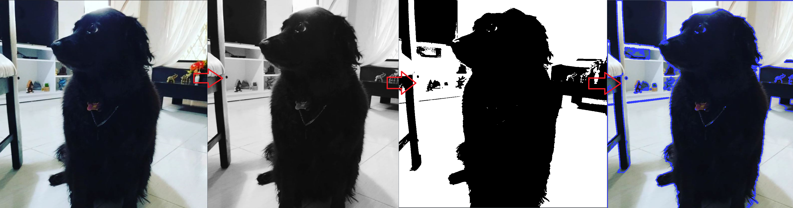
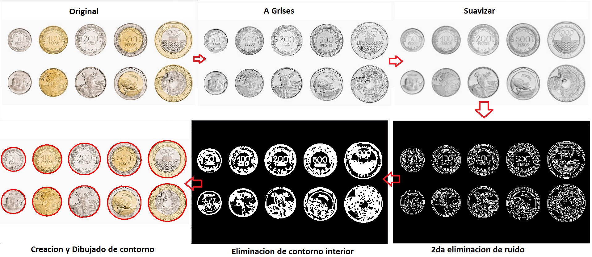

Para realizar este proyecyto de reconocimiento facial se necesita intalar open cv
### https://pypi.org/project/opencv-contrib-python/
Es la herramienta que contiene todos los modulos que se necesita para el analisis en imagenes
## Installation 🚀

```
pip install opencv-contrib-python
```

abrir en cmd y o terminal, pegar y ejecutar

## Verificar su intalacion y version: :heavy_check_mark:

```
print(cv2.__version__)
```

### Archivos del curso

|   **Archivo**   |   **Descripcion**   | 
| -------------- | --------------------- |
| [contorno.py](./1.%20contorno/contorno.py) | archivo que convierte una imagen, a grises, a umbrales, para encontrar y dibujar sus contornos |
| [contador.py](./2.%20contador%20de%20monedas/contador.py) | archivo encuentra los contornos de una imagen y contabiliza las cantidad de monedas que se muestra en una imagen | 

### Funciones utilizadas:

|   **Funciones**   |   **Archivo**   | 
| -------------- | --------------------- |
| []() | []() |
| [imread](https://docs.opencv.org/3.4/d4/da8/group__imgcodecs.html#ga288b8b3da0892bd651fce07b3bbd3a56) | [contorno.py](./1.%20contorno/contorno.py) |
| [ctvColor](https://docs.opencv.org/3.4/d8/d01/group__imgproc__color__conversions.html#ga397ae87e1288a81d2363b61574eb8cab)| [contorno.py](./1.%20contorno/contorno.py) |
| [threshold](https://docs.opencv.org/3.4/d7/d1b/group__imgproc__misc.html#gae8a4a146d1ca78c626a53577199e9c57) | [contorno.py](./1.%20contorno/contorno.py) |
| [findContours](https://docs.opencv.org/4.x/d3/dc0/group__imgproc__shape.html#gadf1ad6a0b82947fa1fe3c3d497f260e0) | [contorno.py](./1.%20contorno/contorno.py) |
| [drawContours](https://docs.opencv.org/4.x/d6/d6e/group__imgproc__draw.html#ga746c0625f1781f1ffc9056259103edbc) | [contorno.py](./1.%20contorno/contorno.py) |
| [imshow](https://docs.opencv.org/4.x/d7/dfc/group__highgui.html#ga453d42fe4cb60e5723281a89973ee563) | [contorno.py](./1.%20contorno/contorno.py) |
| [waitKey](https://docs.opencv.org/4.x/d7/dfc/group__highgui.html#ga5628525ad33f52eab17feebcfba38bd7) | [contorno.py](./1.%20contorno/contorno.py) |
| [destroyAllWindows](https://docs.opencv.org/4.x/d7/dfc/group__highgui.html#ga6b7fc1c1a8960438156912027b38f481) | [contorno.py](./1.%20contorno/contorno.py) |
| -------------- | --------------------- |
| [GaussianBlur](https://docs.opencv.org/4.x/d4/d86/group__imgproc__filter.html#gaabe8c836e97159a9193fb0b11ac52cf1) | [contador.py](./2.%20contador%20de%20monedas/contador.py) |
| [Canny](https://docs.opencv.org/4.x/dd/d1a/group__imgproc__feature.html#ga04723e007ed888ddf11d9ba04e2232de) | [contador.py](./2.%20contador%20de%20monedas/contador.py) |
| [np.ones](https://numpy.org/doc/stable/reference/generated/numpy.ones.html) | [contador.py](./2.%20contador%20de%20monedas/contador.py) |
| [morphologyEx](https://docs.opencv.org/4.x/d9/d61/tutorial_py_morphological_ops.html) | [contador.py](./2.%20contador%20de%20monedas/contador.py) |


## Ejemplo caso de uso:
### [contorno.py](./1.%20contorno/contorno.py)
 

### [contador.py](./2.%20contador%20de%20monedas/contador.py)
 

#### Resultado de print:
 


